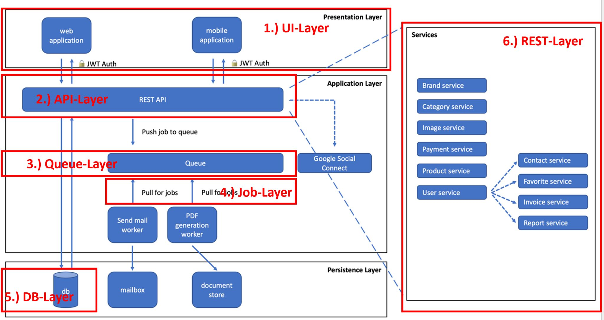
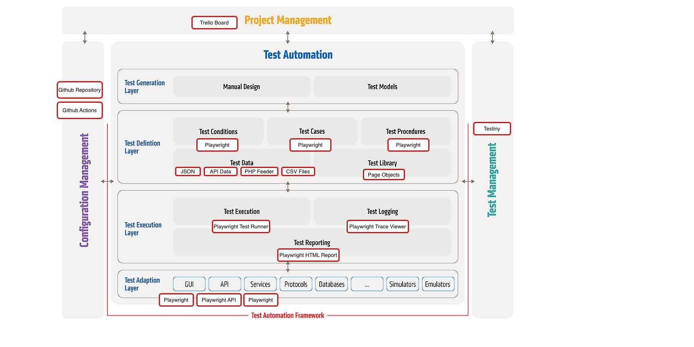

# Test Automation Strategy 

---
## Change Log 
Author: Dilek Firat  
Status: Approved  
Approver: Rudolf Groetz & Jane Doe  
Approval Date: 2026-06-15  

## 1. Introduction

### 1.1 Purpose
The purpose of this document is to define the Test Automation Strategy for the Toolshop application.
 
The goals of this Test Automation Strategy are to:

**G1:** Enable reliable automated regression testing  
**G2:** Provide fast feedback within the CI/CD pipeline  
**G3:** Reduce manual regression testing effort  
**G4:** Improve software quality and release confidence  
**G5:** Support maintainable and reusable automated test solutions  
**G6:** Establish clear responsibilities, tooling, and execution processes  

---

## 2. System Under Test (SUT) Overview

### 2.1 Test Architecture Overview

The System Under Test (SUT) is the public Practice Software Testing Toolshop application.

The application is designed as a demo e-commerce platform for software testing practice and automation training. The platform supports customer workflows such as product browsing, user registration, login, shopping cart management, and checkout processes.

The following diagram shows the test architecture (adaptation layer based on the generic Test Automation Architecture from ISTQB) of the Toolshop application. The red marked layers represent the test automation layers that are relevant from a Test Automation perspective and serve as the basis for defining the Test Automation Architecture and tool mapping.

Based on the publicly available project structure and observed application behavior, the application consists of the following layers:

1.) UI Layer
  - Angular-based web frontend. Customer interacts via browser UI.
  - Mobile UI is a native Android app. Customer interacts via native Android app.

2.) API Layer
  - Via REST APIs for authentication, products, cart, and checkout-related functionality
  - Via API gateway the REST microservices will be called.

3.) Queue Layer
  - Supports asynchronous communication between application components
  - Used for background processing and message handling

4.) Job Layer
  - Background workers responsible for processing queued jobs
  - Examples include email generation and PDF invoice generation

5.) DB Layer
  - Persistent storage for users, products, orders, invoices, and application data
  - Supports data retrieval and data validation activities

6.) REST Layer
  - Collection of backend microservices
  - Includes services such as Product Service, User Service, Payment Service, Invoice Service, and Report Service
  - Implements business logic and provides functionality through REST APIs

The project is publicly available on GitHub and supports collaborative testing and automation activities.

### 2.2 Test Automation Scope

The test automation scope defines the boundaries of what will be automated.

#### 2.2.1 The Most Important Use Cases

**1. User Registration**
- Register a new customer account using valid input data
- Reference Test Case:
  - T1_REGISTER_withValidInput_loginPageWillBeDisplayed

**2. User Login**
- Login with valid user credentials
- Reference Test Case:
  - T1_LOGIN_withValidCredentials_productListPageWillBeDisplayed

**3. Product Search**
- Search for an existing product
- Reference Test Case:
  - T1_SEARCH_withExistingProduct_productWillBeDisplayed

**4. Add to Cart**
- Add products to the shopping cart
- Reference Test Case:
  - T1_ADDTOCART_addThreePiecesToCart_cartCounterIsThree

**5. Checkout**
- Complete a purchase using a valid customer workflow
- Reference Test Case:
  - T1_CHECKOUT_withValidCredentialsAndValidWorkflow_invoiceIdWillBeDisplayed

### 2.3 Test Automation Tools

| Layer               | Tool            | Automation Approach                                      |
| ------------------- | --------------- | -------------------------------------------------------- |
| UI Layer (Web)      | Playwright      | Direct automation through the web user interface         |
| UI Layer (Mobile)   | Appium          | Direct automation through the native Android application |
| API Layer           | Playwright API  | Direct automation through REST APIs                      |
| Queue Layer         | Implicit via UI | Validated indirectly through UI and end-to-end workflows |
| Job Layer           | Implicit via UI | Validated indirectly through UI and end-to-end workflows |
| Database Layer      | Implicit via UI | Validated indirectly through UI and application behavior |
| REST Services Layer | Implicit via UI | Validated indirectly through API and UI interactions     |

### 2.3.1 Tool Mapping Overview (generic Test Automation Architecture)

The following diagram illustrates the mapping of tools, technologies, and automation components to the Generic Test Automation Architecture (gTAA) layers. It provides an overview of how the Toolshop Test Automation Solution is structured and which tools are used in each layer.

### 2.4 Test Automation Patterns

The following test automation patterns will be applied within the Toolshop test automation solution.

#### 2.4.1 Page Object Model (POM)

The Page Object Model (POM) pattern will be used to separate test logic from UI implementation details.

Each page or major application component will be represented by a dedicated Page Object that encapsulates:

* Locators
* UI interactions
* Reusable page-specific actions

Benefits:

* Improved maintainability
* Reduced duplication of UI interaction code
* Easier adaptation to UI changes

Examples:

* LoginPage
* ProductListPage
* ShoppingCartPage
* CheckoutPage

#### 2.4.2 Data-Driven Testing (DDT)

The Data-Driven Testing (DDT) pattern will be used to separate test data from test logic.

Test data will be provided through:

* JSON files
* API-generated test data
* Dynamically generated test data

Benefits:

* Reduced duplication of test data
* Improved maintainability
* Easier management of test preconditions and test inputs
* Support for repeatable test execution through unique test data generation

Examples:

* Registration tests using unique user data to allow repeated execution without database resets
* API-based creation of product test data

#### 2.4.3 Keyword-Driven Testing (KDT)

The Keyword-Driven Testing (KDT) pattern will be used to improve the readability, maintainability, and reusability of automated tests.

Keywords represent reusable actions that encapsulate interactions with the application under test. These actions can be combined to create higher-level business workflows.

Examples of keywords include:

* `enterEmail()`
* `enterPassword()`
* `clickLogin()`
* `searchProduct()`
* `addProductToCart()`

Benefits:

* Improved readability of automated tests
* Increased reusability of common actions
* Reduced duplication of automation code
* Easier maintenance of automated test suites

Within the Toolshop project, keywords will be implemented as reusable automation methods within Page Objects and workflow components. The Keyword-Driven approach complements the Page Object Model by providing reusable actions that can be combined to automate end-to-end user workflows.

---

## 3. Responsibilities

| Activity | Responsible |
|-----------|------------|
| Test Automation Analyse / Design | Test Engineer |
| Prioritize automated test cases | Product Owner (PO) |
| Develop / Maintain automated test cases | TAE |
| Update and maintain test automation tools | TAE |

## 4. Test Data Management

Test data should support reliable, repeatable, and independent automated test execution.

The following principles apply:

- Unique user credentials are generated for automated registration workflows
- Automated tests should not rely on shared user accounts
- Test cases should be independent and executable in any order
- Product test data should be created through APIs before test execution where appropriate
- Test data creation should be automated to reduce manual preparation effort

## 5. Test Automation Principles

- We automate to detect regression
- We automate to provide fast feedback
- We don't automate checks of acceptance criteria
- We don’t automate unstable functionality
- We continuously re-evaluate & analyze our automated tests and asking ourselves 
  - What is the test doing? 
  - What value is this test providing?
  - Is this testing the right thing?
- We treat test code like production code
- We develop independent tests
- Tests should all be hermetic
- Execution of one test should not affect another
- Tests run in dedicated testing environments
- UI tests ensure the whole system works as per some common user scenarios and use cases
